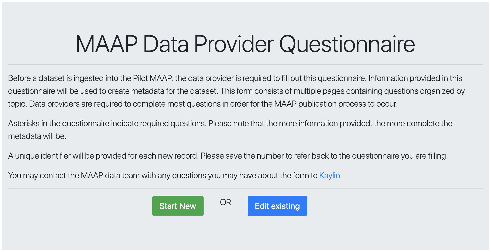

# User Metadata Form

This form serves a similar purpose to the original PI Questionnaire, but is focused on the user shared metadata workflow. Before a collection gets ingested into the Pilot MAAP, the data provider is required to fill out this for. This form will be used to populate metadata fields for the data set.

This repo is a fork of /pi-questionnaire and the following Readme has not been changed.

## How to run the User Metadata Form application on your development machine

These instructions will get you a copy of the project up and running on your local machine for development and testing purposes. See deployment for notes on how to [deploy](#deployment) the project on a live system.

1. Clone this repo `git clone git@github.com:MAAP-Project/user-metadata-form.git`
2. `cd user-metadata-form`

### Prerequisites

Before moving into installing all the gems used, please make sure that you have ruby installed. You can do so by typing `ruby -v` in your terminal. We are currently using `ruby 2.7.5` as described in the `.ruby-version` file. If your machine doesn't have any ruby binaries, you can follow [this blog](https://www.phusionpassenger.com/library/walkthroughs/deploy/ruby/ownserver/nginx/oss/install_language_runtime.html) .

After ruby is installed, install `bundler` using `gem install bundler` in your terminal. Bundler is a package (gem) manager for ruby. You can read about it at [Bundlers' website](https://bundler.io/) .

We use postgres as our database. If your machine doesn't have postgres installed, please do so. You can follow [Postgres installation guide](https://wiki.postgresql.org/wiki/Detailed_installation_guides).

### Configure environment variables

You will need a few environment variables to configure the application to call Cumulus. Create a copy of `example.env`:

```bash
cp example.env .env
```

Update `.env` with the parameters for calling the Cumulus API (CUMULUS_REST_API, EARTHDATA_USERNAME and EARTHDATA_PASSWORD).

### Run the app on your development machine

Once ruby and postgres are properly installed, change directory into the project folder if you have not already:

```bash
cd user-metadata-form

Then we need to install the gems used in the project, prepare the database etc.

```bash
bundle install
bundle exec rails db:create
bundle exec rails db:migrate
# Wait for the migration to complete.
# Source environment variables used to call Cumulus.
source .env
bundle exec rails s
```

This will start the server at port 2998. Go to your browser, navigate to `localhost:2998`. You should be able to see the following page:



## Run the app in a docker container

Running the application using docker is a closer approximation to how the application will run in a cloud environment. It isolates the environment used to build and run the application. The application is deployed by creating a docker image and publishing it to AWS Elastic Container Registry (ECR). Then the application is run as a docker container within an ECS Task.

```bash
docker build -f deployment/Dockerfile -t umf .
docker run --rm --env-file .env \
  --env DATABASE_HOST=host.docker.internal \
  -p 2998:2998 -t umf

## Deployment

See [deployment/README.md](./deployment/README.md).

## Built With

* [Rails](https://rubyonrails.org/) - The web framework used
* [Bundler](https://bundler.io/) - Dependency Management

## Contributing

To make your changes:

1. Fork this repo.
2. If you are working on a feature, use the naming convention `feature-<feature name>`, if it's a bug use `bug-<name>`. (please make sure there is a corresponding issue listed at https://github.com/MAAP-Project/user-metadata-form/issues before working on the changes.)
3. Create a pull request against the master branch of this repo.

## License

This project is licensed under the MIT License - see the [LICENSE.md](LICENSE.md) file for details
